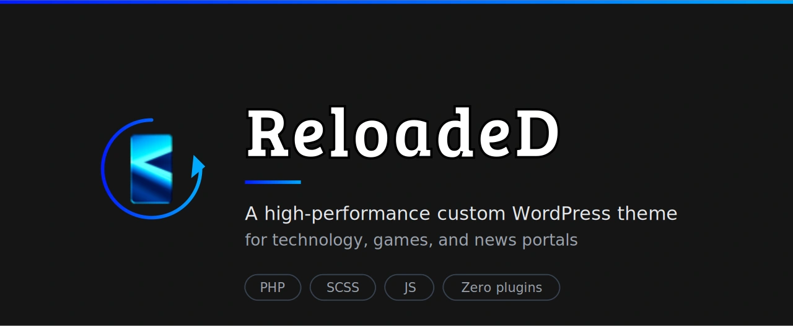

[Features](#-features) • [Requirements](#%EF%B8%8F-requirements) • [Installation](#-installation) • [Theme Options](#-theme-options) • [Branches & Releases](#-branches--releases) • [Development](#-development) • [Support](#-support-the-project--apoie-o-projeto)

---

## 🖥️ About the Project

### A high-performance custom WordPress theme for technology, games, and news portals. Built around a strict "zero external plugins" philosophy: Markdown rendering (Parsedown) and code syntax highlighting (Prism.js) are bundled directly into the theme. No third-party dependencies, no plugin sprawl — every feature is exposed and configurable through a 9-tab admin panel.

     

 

> [!NOTE]
> **Status:** Active development. Public release planned once feature-complete.

---

## 🪶 Features

### Zero external plugins:

- ✅ Self-contained architecture — no third-party plugin dependencies for core functionality. Every rendering layer is bundled with the theme.

### Native Markdown post authoring:

- ✅ Write posts in Markdown syntax (similar to GitHub or Docker Hub READMEs) and have them rendered automatically through Parsedown. Code blocks are highlighted via Prism.js, loaded only on single posts to preserve performance.

### 9-Tab admin control panel:

- ✅ Every feature is exposed via a dedicated tab — General, Privacy (LGPD), Integrations, Performance, Social, SEO, Donations, Ads, and Maintenance. All settings are documented inline with contextual help for each option.

### Performance-first architecture:

- ✅ Disables WordPress bloat by default (native emojis, Gutenberg CSS, generator meta) and lazy-loads heavy iframes via a facade system (YouTube and similar embeds).

### Compliance and SEO out of the box:

- ✅ LGPD cookie banner, Open Graph meta tags for social sharing, and proper HTTP 503 maintenance mode — all native to the theme, no third-party services.

### Native engagement tracking:

- ✅ Per-post view counter with automatic bot filtering and 30-minute IP deduplication window. Built-in, no external analytics required.

### Donations and integrations:

- ✅ Built-in support for GitHub Sponsors, PayPal, and PIX (with QR code uploads), Discord widget, Google Analytics, and 8 social network links. Pre-defined ad zones for AdSense (728×90, 320×100, 300×250, 300×600).

---

## ⚒️ Requirements

> [!IMPORTANT]
> ✔️ WordPress 6.9.4 or later
> ✔️ PHP 8.2 or later
> ✔️ MySQL 8.0+ or MariaDB 10.5+
> ✔️ HTTPS strongly recommended

---

## 📦 Installation

There are two ways to install the ReloadeD theme on your WordPress site.

### Option 1: From the WordPress admin (recommended)

1. Download the latest `reloaded.zip` from the [Releases page](https://github.com/Finallf/theme-reloaded/releases).

2. In your WordPress admin, navigate to **Appearance → Themes → Add New → Upload Theme**.

3. Select the downloaded `reloaded.zip` file and click **Install Now**.

4. Once installation is complete, click **Activate** to apply the theme.

### Option 2: Manual upload via FTP/SFTP

1. Download and extract `reloaded.zip` locally.

2. Upload the extracted `reloaded` folder to your server's `wp-content/themes/` directory.

3. In your WordPress admin, go to **Appearance → Themes** and click **Activate** on ReloadeD.

> [!NOTE]
> After activation, the theme's control panel becomes available under **ReloadeD** in the WordPress admin sidebar (position right below Dashboard).

> [!TIP]
> **Beta channel users:** to get pre-release builds with features in active testing, download the `reloaded.zip` from a release tagged as **Pre-release** on the [Releases page](https://github.com/Finallf/theme-reloaded/releases). See [Branches & Releases](#-branches--releases) for the channel model.

---

## 🎨 Theme Options

After activation, the theme's control panel is accessible via **ReloadeD** in the WordPress admin sidebar. All settings are organized into 9 dedicated tabs.

### 🔧 General

Core theme behavior — UI controls, image processing, and content presentation.

| Setting | Description | Default |
| --- | --- | --- |
| Back to top button | Floating button at the bottom-right for quick page-top navigation | ON |
| Top bar | Header strip with date, latest news, and social links | ON |
| Image hard crop | Forces exact crops on uploaded images for banner/card alignment | ON |
| Featured image control | Adds an option in the post editor sidebar to hide the featured image when reading (ideal for posts with videos at the top) | ON |
| JPEG quality | Image quality in % (WP default is 82). Lower values = faster site, less visual fidelity | 90 |
| Comment accessibility | Adds labels and autocomplete attributes to the comment form | ON |
| "Read More" button text | Custom text for the excerpt button (empty = theme default) | Empty |
| Comments separator | Text between author and post (empty = WP default, `&nbsp;` to hide) | Empty |
| Date format | PHP-style date format string. Example: `l, j \d\e F \d\e Y` outputs "Monday, April 29 2026" | Empty |
| View counter | Per-post view tracking (1 IP = 1 view per 30 minutes, bots auto-filtered) | ON |

### 🔒 Privacy (LGPD)

Brazilian LGPD (General Data Protection Law) compliance — cookie consent banner.

| Setting | Description | Default |
| --- | --- | --- |
| LGPD cookie banner | Shows the consent banner in the site footer | ON |
| Banner text | Custom HTML message for the banner (basic markup allowed: `<a>`, `<strong>`) | Default LGPD message |

### 🔌 Integrations

External service integrations — analytics and Discord widget.

| Setting | Description | Default |
| --- | --- | --- |
| Google Analytics ID | Tracking Tag ID (e.g. `G-XXXXXXX`). Empty = disabled | Empty |
| Discord widget | Display the Discord server widget in the sidebar | ON |
| Discord server ID | Server ID required for the official Discord widget | Empty |

### ⚡ Performance

Technical optimizations — Markdown rendering, syntax highlighting, and WordPress bloat removal.

| Setting | Description | Default |
| --- | --- | --- |
| Markdown | Enable Markdown syntax in posts (rendered via Parsedown) | ON |
| Code highlighting | Prism.js for code blocks (loaded only on single posts) | ON |
| Disable native emojis | Remove WordPress emoji script (modern browsers render emojis natively) | ON |
| Hide WP version | Remove the `<meta name="generator">` tag from the source code | ON |
| Iframe facade system | Replace heavy iframes (e.g. YouTube) with a lightweight image that loads the real player only on click | ON |
| Disable Gutenberg CSS | Remove Gutenberg block styles globally (recommended when using Markdown) | ON |

### 🌐 Social

Links to the site's official social network profiles. Used in the top bar, sidebar widgets, and Open Graph tags.

| Setting | Description | Default |
| --- | --- | --- |
| Discord | Server invite link | Empty |
| Telegram | Channel or group link | Empty |
| YouTube | Channel URL | Empty |
| Instagram | Profile link | Empty |
| Steam | Group or curator link | Empty |
| Twitter (X) | Profile link | Empty |
| Facebook | Page or community link | Empty |
| WhatsApp | Direct number or group link (international format) | Empty |

### 🔍 SEO

Open Graph meta tags for social sharing previews.

| Setting | Description | Default |
| --- | --- | --- |
| Open Graph meta tags | Generate OG tags for Facebook, Discord, WhatsApp, and other social platforms | ON |
| Open Graph fallback image | Default image used when a post has no featured image | Empty |

### 💝 Donations

Donation channels displayed on the theme — supports global and Brazil-specific options.

| Setting | Description | Default |
| --- | --- | --- |
| GitHub Sponsors | Sponsor page URL | Empty |
| PayPal donation link | Direct PayPal donation URL | Empty |
| PayPal QR code | QR code image upload for PayPal | Empty |
| PIX URL | Direct PIX payment URL (when provided by your bank) | Empty |
| PIX QR code | QR code image upload for PIX | Empty |
| PIX key | Direct PIX key (email, CPF/CNPJ, or random) | Empty |

### 📢 Ads

Ad zones for AdSense and similar networks. Each slot accepts raw HTML/JS code.

| Setting | Description | Default |
| --- | --- | --- |
| Global ads script | `<head>` global tag (e.g. AdSense Auto Ads) | Empty |
| Top banner — desktop | Header banner for large screens (728×90) | Empty |
| Top banner — mobile | Header banner for small screens (320×100) | Empty |
| Sidebar top banner | Sidebar slot above other widgets (300×250) | Empty |
| Sidebar sticky banner | Sidebar slot that follows scroll (300×600) | Empty |

### 🚧 Maintenance

Maintenance mode with developer bypass — preserves SEO via proper HTTP 503 status.

| Setting | Description | Default |
| --- | --- | --- |
| Maintenance mode | Block visitors and show a "back soon" page (returns HTTP 503 to search engines) | OFF |
| Developer password | Bypass password for developers. Access via `yoursite.com/?rd-dev-login` and submit through the form (never via URL parameter). Stored as a cryptographic hash | Empty |
| Maintenance message | Custom HTML message shown on the block page (basic tags allowed: `<strong>`, ` `) | Empty |

---

## 🌿 Branches & Releases

The project follows a two-channel release model managed by [semantic-release](https://semantic-release.gitbook.io/). Releases are generated automatically from commit messages following the [Conventional Commits](https://www.conventionalcommits.org/) specification.

### Channels

| Branch | Channel | Use case |
| --- | --- | --- |
| `master` | Stable | Production-ready releases. Recommended for live sites. |
| `beta` | Pre-release | Early testing of new features. Tagged as **Pre-release** on the [Releases page](https://github.com/Finallf/theme-reloaded/releases). |

### How releases are triggered

Only certain commit types create a new release:

| Commit type | Triggers release? | Version bump |
| --- | --- | --- |
| `feat:` | ✅ Yes | Minor (`1.2.0` → `1.3.0`) |
| `fix:` | ✅ Yes | Patch (`1.2.0` → `1.2.1`) |
| Breaking change (`feat!:` or `BREAKING CHANGE:` footer) | ✅ Yes | Major (`1.2.0` → `2.0.0`) |
| `chore:`, `docs:`, `ci:`, `style:`, `refactor:`, `test:`, `build:` | ❌ No | — |

### Release artifacts

Each release publishes a `reloaded.zip` file ready for WordPress installation (see [Installation](#-installation)) — folder structure wrapped in `reloaded/`, dev-only files excluded. Download from the [Releases page](https://github.com/Finallf/theme-reloaded/releases).

The `CHANGELOG.md` is regenerated automatically from commit history with each release.

---

## 💻 Development

### Stack

ReloadeD is built with **PHP 8.2+** on the WordPress framework, **SCSS** with the modular `@use` system, and **vanilla JavaScript** — no JS frameworks, no build pipeline beyond Sass compilation, no npm dependencies required for theme code.

### Local setup

1. Clone the repository into your local WordPress installation:

       cd wp-content/themes/
       git clone https://github.com/Finallf/theme-reloaded.git reloaded

2. Open the `reloaded` folder in your IDE. The repository ships with `.vscode/settings.json` (workspace settings) and `.vscode/extensions.json` (recommended extensions) — VS Code offers to install the recommended extensions on first open.

3. Activate the theme via **Appearance → Themes** in the WordPress admin.

### SCSS compilation

SCSS source files live in `sass/`. Compilation is handled by the [Live Sass Compiler](https://marketplace.visualstudio.com/items?itemName=glenn2223.live-sass) VS Code extension (listed in `.vscode/extensions.json`). The compile target and Autoprefixer settings are versioned in `.vscode/settings.json`:

- **Output:** `assets/css/style.css`
- **Format:** Expanded (readable, source maps enabled)
- **Browser targets:** `> 1%, last 2 versions`
- **Watch on launch:** enabled (compiles automatically on save when VS Code opens)

> [!NOTE]
> Brand color tokens are defined in `sass/` partials. Primary palette: `#031CFF` (`$brand-blue-dark`), `#00A8FF` (`$brand-blue-light`), `#151515` (`$dark-bg`). Typography: Inter and Poppins (self-hosted).

### Repository structure

| Path | Purpose |
| --- | --- |
| `style.css` | Theme header (auto-bumped by semantic-release on each release) |
| `panel.php` | Admin control panel (the 9-tab settings UI) |
| `sass/` | SCSS source files (modular `@use` structure) |
| `assets/css/` | Compiled CSS (generated by Live Sass, committed) |
| `assets/img/` | Theme images and brand assets |
| `.vscode/` | Versioned workspace settings and recommended extensions |
| `.github/workflows/` | CI/CD pipelines (semantic-release on `master` and `beta` push) |
| `.editorconfig` | Editor consistency rules (4-space indent, LF, UTF-8) |

### Contributing changes

Follow the [Conventional Commits](https://www.conventionalcommits.org/) specification on commit messages — the release pipeline relies on commit prefixes (`feat:`, `fix:`, etc.) to determine version bumps. See [Branches & Releases](#-branches--releases) for which types trigger a release.

---

## ☕ Support the Project / Apoie o Projeto

If this project has helped you in any way, consider buying me a coffee! Your donation helps keep the updates and documentation current.

🇧🇷 Se este projeto te ajudou de alguma forma, considere me pagar um café! Sua doação ajuda a manter as atualizações e a documentação.

| 🌎 GitHub Sponsors |  |  PayPal |
| --- | --- | --- |
| You can support me through GitHub Sponsors.   | 🇧🇷 Escaneie o QR Code:   | Click or scan the QR code:   |

🇧🇷 Ou utilize a Chave Pix (Copia e Cola):

    25d1d528-df10-4005-bb28-2acf89706243

---

## 💪 How to Contribute

Contributions are welcome — bug fixes, new features, and documentation improvements all help the project grow. The release pipeline depends on [Conventional Commits](https://www.conventionalcommits.org/) for automatic versioning, so please follow the convention in your commit messages.

1. **Fork** the repository.

2. **Create a feature branch** from `beta`:

       git checkout -b feat/my-feature       # for new features
       git checkout -b fix/my-bugfix         # for bug fixes

3. **Make your changes** and commit using Conventional Commits:

       git commit -m "feat: add custom widget for related posts"
       git commit -m "fix: prevent duplicate views from same IP"

4. **Push** to your fork:

       git push origin feat/my-feature

5. **Open a Pull Request** targeting:
   - `beta` for new features and non-breaking changes (lands on the pre-release channel first)
   - `master` for critical hotfixes that need to ship to stable immediately

> [!TIP]
> Before opening a PR, recompile the SCSS via Live Sass to keep `assets/css/style.css` in sync. Since the compiled CSS is committed to the repository, untested SCSS changes can break the visual layer for everyone.

---

## 🛠️ Technologies

The following tools and technologies were used in the construction of this project:

      

---

## 🧑‍💻 Collaborators:

💜 Thank you to everyone who contributed to the improvement of this project 😊

<!-- readme: collaborators,contributors -start -->
<table>
	<tbody>
		<tr>
            <td align="center">
                <a href="https://github.com/Finallf">
                    
                     
                    <b>Finallf</b>
                </a>
            </td>
            <td align="center">
                <a href="https://github.com/semantic-release-bot">
                    
                     
                    <b>semantic-release-bot</b>
                </a>
            </td>
		</tr>
	<tbody>
</table>
<!-- readme: collaborators,contributors -end -->

---

## 🧙‍♂️ Author:

   

---

## 📝 License:

> [!WARNING]
> This project is licensed under: [GPL-2.0-or-later license](https://github.com/Finallf/theme-reloaded?tab=GPL-2.0-1-ov-file).
